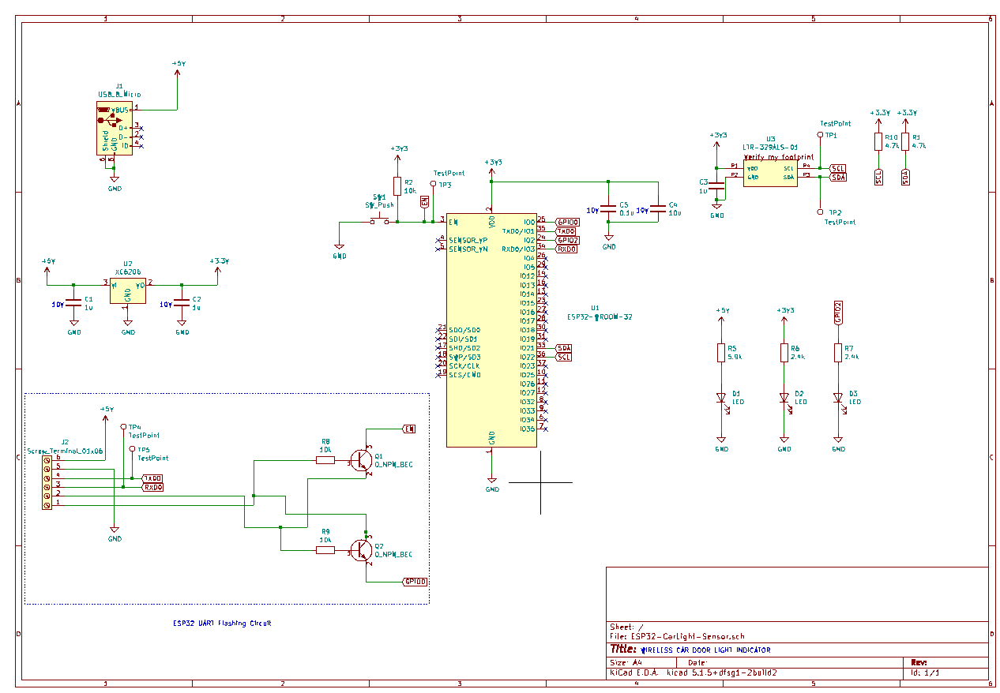

# Wireless Car Light Sensor-Transmitter

## Background

In the cold winter months, the door sensors in my car don't seem to work as well, and its very easy for the door light to be on, causing the battery to drain. Because of the tinted windows, this was hard to see a lot of the times. When this happened a few times over the course of a month, I got frustrated and decided to create an automated IoT based solution that would tell me when the door light was left open. 

## Implementation

I used an ESP32-WROOM SoC and an LTR329 Ambient Light sensor on a two layer PCB. The wireless communication capabilities of the ESP32 made it easy to send send the state of the car lights, so I can just see the status from a server running on my computer in the room. 

I used I2C to develop a sensor driver for the ambient light sensor, and via WiFi, sent HTTP POST requests to validate my understanding of TCP and socket communication. The sensor driver operation and POST request transmission happened in parallel via FreeRTOS multithreading. The firmware was written in C via ESP-IDF.

## Schematic

## Images
The PCB is currently under assembly, will be updated accordingly